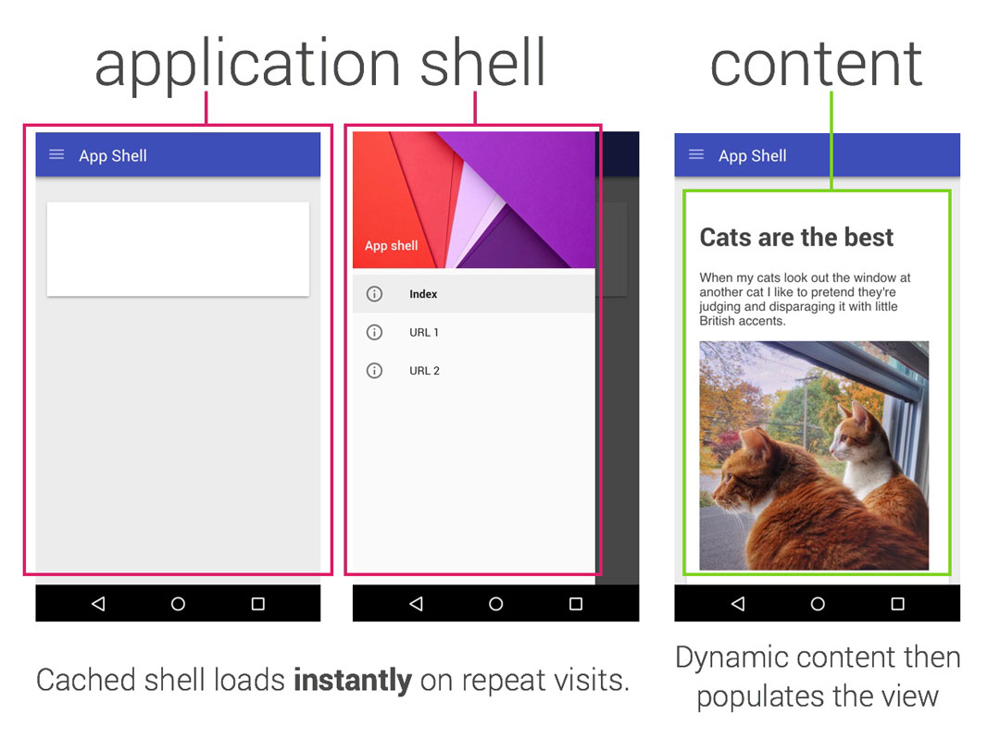
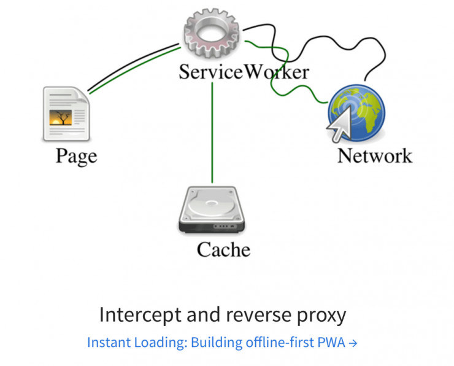
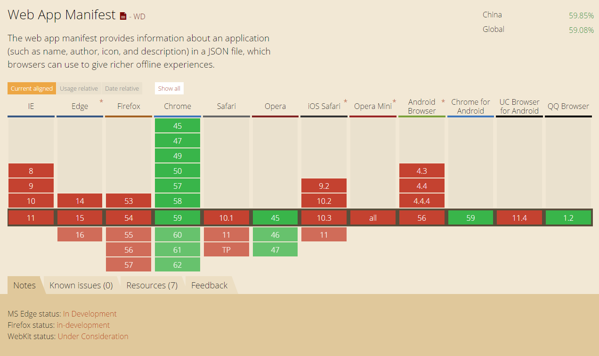

# PWA(Progressive web apps)——渐进式Web App

> 关键词：渐进式、快速、安全、可安装

PWA是一系列Web新技术的整合，由Google提出，主要包括**离线存储**、**后台消息推送**、**可安装**、**HTTPS**、**响应式设计**等。提倡以渐进式增强的方式提供与Native App体验，在比传统网页应用更好的同时也保证了降级兼容。


[更多Demo](https://pwa.rocks/)

## 渐进式

>如果用户需要，网页可以渐进式地变成App，比如被添加到主屏幕、全屏方式运行、离线工作、推送通知消息等。但它仍是Web而非放到App Store里。

具体实现方式：在网页上构建一个shell，异步装载内容，像Ajax那样子局部更新。



## 快速

PWA的核心技术是离线存储，通过离线存储Web资源使得页面打开时具有App一样的响应速度。

离线存储是通过Service Workers实现。Service Workers作为一个后台进程，可以使用Javascript拦截请求和控制缓存，并依据不同策略进行后台更新缓存。



除此之外，Service Worker还可以订阅服务，接收推送。通过调用操作系统消息接口，能实现Native App一致的消息提示。

## 安全

安全是建立在HTTPS协议和同源策略上。

## 可安装

可以在桌面或主屏幕创建一个图标，像Native App一样访问。通过网页外链一个Manifest文件（JSON）来描述这个应用，包括应用名、描述、图标、背景颜色、关联网站等信息。

```html
<link rel="manifest" href="/manifest.json">
```

```json
{
  "short_name": "Manifest Sample",
  "name": "Web Application Manifest Sample",
  "icons": [
    {
      "src": "launcher-icon-2x.png",
      "sizes": "96x96",
      "type": "image/png"
    }
  ],
  "start_url": "/index.html",
  "display": "standalone",
  "orientation": "landscape"
}
```

## 兼容性

除了IOS平台，其他主流浏览器都在跟进这项技术。这项技术和“热更新”差不多，所以苹果为了保护它的封闭生态，目前并没有明确表示支持。



参考：

1. [我们真的需要网页版App吗？Google PWA的困局](https://www.leiphone.com/news/201606/UEiart497WUzS62u.html)

2. [Progressive web apps - App Center | MDN](https://developer.mozilla.org/en-US/Apps/Progressive)