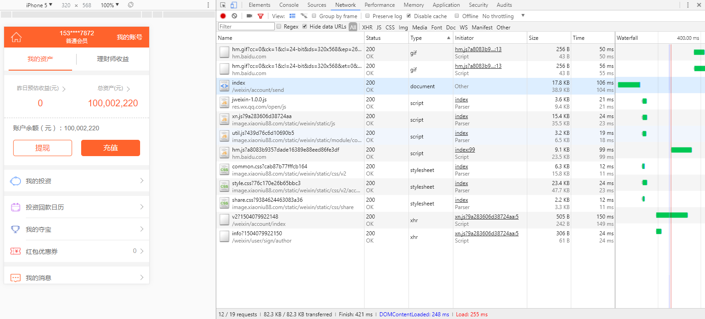
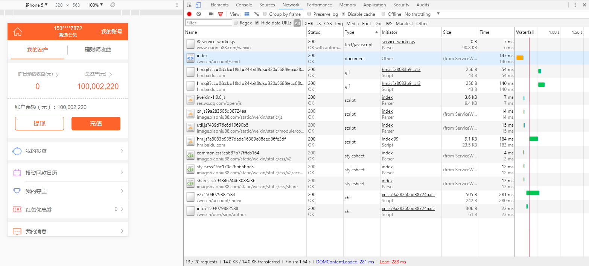
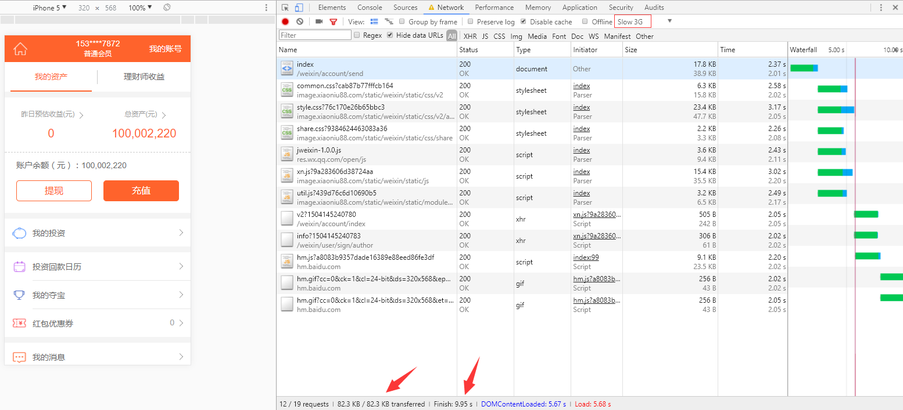
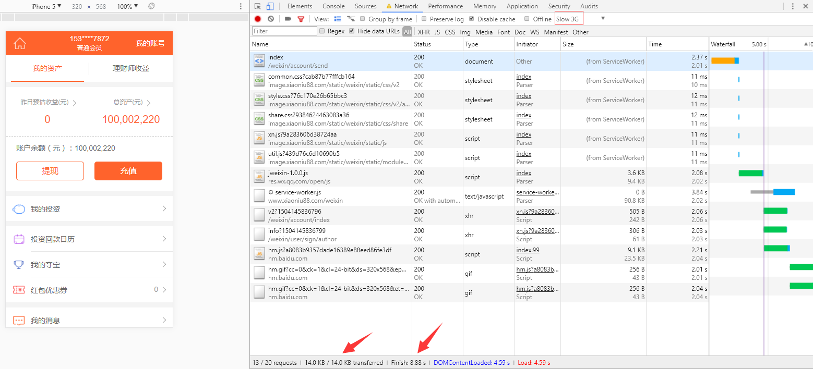

# 在线service-worker缓存实施指南

### gulp构建任务

安装sw-precache库`npm i --save-dev sw-precache`，新增sw文件构建gulp任务

```js
var swPrecache = require('sw-precache');

gulp.task('sw', function() {
    var rootDir = 'WebHtml/weixin/static';
    var config = {
        cacheId: 'xiaoniu88.com',
        handleFetch: true,
        runtimeCaching: [{
            method:'get',
            urlPattern: /^https:\/\/www\.xiaoniu88\.com\/weixin\/[\w\/]+$/,
            handler: 'networkFirst'
        }],
        staticFileGlobs: [
            rootDir + '/**/**.css',
            // rootDir + '/**.html',
            rootDir + '/**/**.[jpg|png|gif]',
            rootDir + '/**/**.js'
        ],
        ignoreUrlParametersMatching: [/./],
        stripPrefix: rootDir,
        replacePrefix: 'https://image.xiaoniu88.com/static/weixin/static',
        verbose: true
    };
    swPrecache.write(path.join('WebHtml/weixin', 'service-worker.js'), config, function() {
        console.log('sw finish');
    });
});

```

### nginx配置

在应用域名(www.xiaoniu88.com)下加上反向代理，将 https://www.xiaoniu88.com/weixin/service-worker.js 指向 https://image.xiaoniu88.com/static/weixin/service-worker.js


在静态资源域名(image.xiaoniu88.com)下加上跨域头

```conf
if ($http_origin = https://www.xiaoniu88.com) {
    add_header 'Access-Control-Allow-Origin' "$http_origin";
    add_header 'Access-Control-Allow-Credentials' "true";
}
```

### 首页注册sw

在主页增加注册sw脚本
```html
<script>
    "use strict";"serviceWorker"in navigator&&window.addEventListener("load",function(){navigator.serviceWorker.register("service-worker.js").then(function(e){e.onupdatefound=function(){var n=e.installing;n.onstatechange=function(){switch(n.state){case"installed":navigator.serviceWorker.controller?console.log("New or updated content is available."):console.log("Content is now available offline!");break;case"redundant":console.error("The installing service worker became redundant.")}}}}).catch(function(e){console.error("Error during service worker registration:",e)})});
</script>
```

### 本地调试结果对比

- 未使用sw（正常网速）



- 使用sw（正常网速）



- 未使用sw（慢3G网速）



- 使用sw（慢3G网速）

