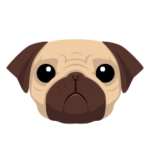

<link href="css/index.css" rel="stylesheet" />

# Pug模板




Pug原名Jade，由于Jade是个注册商标，所以改名了。

官网：[https://pugjs.org](https://pugjs.org)

GitHub:[https://github.com/pugjs/pug](https://github.com/pugjs/pug)

## 导读

[TOC]

## 安装&运行

### 安装

npm安装

```bash
npm install pug --save
npm install pug-cli -g
```

Sublime 插件：在包管理(Ctrl + Alt + P)中搜索[Pug](https://github.com/davidrios/pug-tmbundle)


### 运行

+ 命令行

```bash
pug -P test.pug
```

> `-P`选项是代码美化，默认是不美化代码，输出的HTML标签之间没有换行符

test.pug 文件

```jade
doctype html
html
	head
		meta(charset="utf-8")
		title
	body
		h1 标题
```

编译结果

```html
<!DOCTYPE html>
<html>
  <head>
    <meta charset="utf-8">
    <title></title>
  </head>
  <body>
    <h1>标题</h1>
  </body>
</html>
```

+ 脚本

[API文档](https://pugjs.org/api/reference.html)

```javascript
const pug = require("pug");

// 渲染字符串
console.log(pug.render("h1.page_title 标题"),'\n');

// 渲染数据
console.log(pug.render("h1.page_title #{title}",{title:"标题"}),'\n');

// 渲染文件
console.log(pug.renderFile("test.pug",{pretty:true,title:"标题"}));

```

输出

```html
<h1 class="page_title">标题</h1>

<h1 class="page_title">标题</h1>

<!DOCTYPE html>
<html>
  <head>
    <meta charset="utf-8">
    <title>标题</title>
  </head>
  <body>
    <h1>Hello World!</h1>
  </body>
</html>
```

test.pug

```jade
doctype html
html
    head
        meta(charset="utf-8")
        title #{title}
    body
        h1 Hello World!
```

## 语法

### 标签

和Python类似，Pug是通过缩进来表示层级。

+ 不能越级缩进，以下情况会报错。

```jade
ul
		li
	a
```

<span class="icon_wrong"></span>

这样子就不会报错，但是无法正确格式化。

```jade
ul
	a
		li
	a
```

<span class="icon_wrong"></span>

输出

```html
<ul><a>
    <li></li></a><a></a></ul>
```

这样子就没问题了

```jade
ul
	li
		a
	li
```

<span class="icon_right"></span>

输出

```html
<ul>
  <li><a></a></li>
  <li></li>
</ul>
```

> 能用空格或Tab缩进，但不能两种混合着用

+ 行内表示

在标签后面带个冒号，可以直接嵌套下一层标签。（注意，冒号后面有空格）

```jade
div: p: a: span test
```

输出

```html
<div>
  <p><a><span>test</span></a></p>
</div>
```

+ 闭合标签

自动检测自闭合标签，且不允许自闭合标签带文本。以下情况会报错

```jade
img pic
```

<span class="icon_wrong"></span>

强制自闭合标签

```jade
foo/
```

输出

```html
<foo/>
```

+ DOCTYPE

[doctype对照表](https://pugjs.org/language/doctype.html)

<table>
	<tr>
		<td style="width:200px;">doctype html</td><td>&lt;!DOCTYPE html&gt;</td>
	</tr>
	<tr>
		<td>doctype transitional</td><td>&lt;!DOCTYPE html PUBLIC "-//W3C//DTD XHTML 1.0 Transitional//EN" "http://www.w3.org/TR/xhtml1/DTD/xhtml1-transitional.dtd"&gt;</td>
	</tr>
	<tr>
		<td>doctype strict</td><td>&lt;!DOCTYPE html PUBLIC "-//W3C//DTD XHTML 1.0 Strict//EN" "http://www.w3.org/TR/xhtml1/DTD/xhtml1-strict.dtd"&gt;</td>
	</tr>
	<tr>
		<td>doctype basic</td><td>&lt;!DOCTYPE html PUBLIC "-//W3C//DTD XHTML Basic 1.1//EN" "http://www.w3.org/TR/xhtml-basic/xhtml-basic11.dtd"&gt;</td>
	</tr>
</table>

### 注释

+ 单行注释

`//`非缓存注释，`//-`缓存注释，缓存注释不会出现在编译结果上。

```jade
// just a paragraph
p foo
//- will not output
```

输出

```html
<!-- just a paragraph-->
<p>foo</p>
```

+ 块注释

```jade
body
//-
  will not output
  will not output
  will not output
//
  Comments for your HTML readers
  Comments for your HTML readers
```

输出

```html
<!--
Comments for your HTML readers
Comments for your HTML readers
-->
```

### 文本

标签名用空格隔开的内容当作标签文本。

```jade
// 纯文本
p 测试文本

// 文本中嵌套标签
p 测试<b>文</b>本

// 用管道符号连接多行文本
p 
	| 测试
	b 文
	| 本

// 用点符号连接块文本
script.
	if(value){
		console.log("value is " + value);
	}else{
		console.log("there is not value");
	}
```

输出

```html
<p>测试文本</p>
<p>测试<b>文</b>本</p>
<p>
   测试<b>文</b>本</p>
<script>
  if(value){
    console.log("value is " + value);
  }else{
    console.log("there is not value");
  }
</script>
```

### 属性

紧随标签后，用括号括起来，以空格分隔，自动补全值

```jade
input(class="tb" type="text" placeholder="something" disabled)
```

输出

```html
<input class="tb" type="text" placeholder="something" disabled="disabled"/>
```

+ 支持js表达式

```jade
-var isShow = true
div(class=isShow ? "on" : "off")
```

输出

```html
<div class="on"></div>
```

+ 支持多行

```jade
input(
	class="tb" 
	type="text" 
	placeholder="something" 
	disabled
)
```

输出

```html
<input class="tb" type="text" placeholder="something" disabled="disabled"/>
```

+ 支持布尔值

```jade
input(type="radio" checked=true)
input(type="radio" checked=false)
```

输出

```html
<input type="radio" checked="checked"/>
<input type="radio"/>
```

+ 支持对象转样式列表（仅支持style属性）

```jade
-var obj = {width:"120px",height:"120px",border:"solid 1px #f00"}
div(style=obj)
```

输出

```html
<div style="width:120px;height:120px;border:solid 1px #f00;"></div>
```

+ 支持ID和类简写

```jade
div.foo
div#foo
.foo
```

输出

```html
<div class="foo"></div>
<div id="foo"></div>
<div class="foo"></div>
```

> 没有标明标签类型的ID或类简写，默认为DIV标签

+ 属性转义

```jade
-var val = "<script></script>";
div(data-v=val)
div(data-v!=val)
```

输出

```html
<div data-v="&lt;script&gt;&lt;/script&gt;"></div>
<div data-v="<script></script>"></div>
```

### 代码

可以在模板中加入JS代码，用 - 作为行首表示JS代码。

```jade
ul
	-var ar = ["Tony","Jim","Peter","Lisa","Tiger"];
	-for(var i = 0,len = ar.length; i < len; i++){
		-if(i == 2){
			li=ar[i]+"!"
		-}else{
			li=ar[i]
		-}
	-}
```

输出

```html
<ul>
  <li>Tony</li>
  <li>Jim</li>
  <li>Peter!</li>
  <li>Lisa</li>
  <li>Tiger</li>
</ul>
```

+ 变量插值

```jade
-var foo = 'Tom <>";&';

//- 适用于变量直接插入

div=foo

div!=foo

//- 适用于变量拼接

div #{foo}

div #{foo.toUpperCase()}

div !{foo}

div \#{foo}

//- ES6的模板字符串

div=`${foo}`

//- 字面量

div='Tom <>";&'
```

输出

```html
<div>Tom &lt;&gt;&quot;;&amp;</div>
<div>Tom <>";&</div>
<div>Tom &lt;&gt;&quot;;&amp;</div>
<div>TOM &lt;&gt;&quot;;&amp;</div>
<div>Tom <>";&</div>
<div>#{foo}</div>
<div>Tom &lt;&gt;&quot;;&amp;</div>
<div>Tom &lt;&gt;&quot;;&amp;</div>
```

### 循环及流程控制

+ if/unless指令

```jade
if name
  h1 Hi~ #{name}
else
  h1 what's your name ?
```

输出

```html
<h1>what's your name ?</h1>
```

等同于

```jade
unless name
  h1 what's your name ?
else
  h1 Hi~ #{name}
```

+ each指令

```jade
ul
	each item in ["Tony","Jim","Peter","Lisa","Tiger"]
		li= item				
```

输出

```html
<ul>
  <li>Tony</li>
  <li>Jim</li>
  <li>Peter</li>
  <li>Lisa</li>
  <li>Tiger</li>
</ul>
```

each后面带两个参数，第一个是value，第二个是key

```jade
ul
	each item,index in ["Tony","Jim","Peter","Lisa","Tiger"]
		if index == 0
			li #{item} is first
		else 
			li #{item}
```

输出

```html
<ul>
  <li>Tony is first</li>
  <li>Jim</li>
  <li>Peter</li>
  <li>Lisa</li>
  <li>Tiger</li>
</ul>
```

+ each和else组合

```jade
ul
	each item in []
		li #{item}
	else
		li array is empty
```

输出

```html
<ul>
  <li>array is empty</li>
</ul>
```

+ while指令

```jade
- var n = 0;
ul
  while n < 4
    li= n++
```

输出

```html
<ul>
  <li>0</li>
  <li>1</li>
  <li>2</li>
  <li>3</li>
</ul>
```

+ case指令

相当于JS中的switch

```jade
- var friends = 10
case friends
  when 0
    p you have no friends
  when 1
    p you have a friend
  default
    p you have #{friends} friends
```

输出

```html
<p>you have 10 friends</p>
```

多对一

```jade
- var friends = 0
case friends
  when 0
  when 1
    p you have very few friends
  default
    p you have #{friends} friends
```

输出

```html
<p>you have very few friends</p>
```

使用break

```jade
- var friends = 0
case friends
  when 0
    - break
  when 1
    p you have very few friends
  default
    p you have #{friends} friends
```

输出

```html

```

> 关键字 if unless each while else case when default

### 混合（Mixin）

相当于函数，定义一些重复的动作以达到代码复用的效果。

```jade
//- 声明
mixin list
  ul
    li foo
    li bar
    li baz
//- 使用
+list
+list
```

输出

```html
<ul>
  <li>foo</li>
  <li>bar</li>
  <li>baz</li>
</ul>
<ul>
  <li>foo</li>
  <li>bar</li>
  <li>baz</li>
</ul>
```

+ 传递参数

```jade
mixin pet(name)
  li.pet= name

ul
  +pet('cat')
  +pet('dog')
  +pet('pig')
```

输出

```html
<ul>
  <li class="pet">cat</li>
  <li class="pet">dog</li>
  <li class="pet">pig</li>
</ul>
```

+ 将模板片段作为参数

```jade
mixin article(title)
  .article
    h1= title
    if block
      block
    else
      p empty

+article('Hello world')

+article('Hello world')
  p something
```

输出

```html
<div class="article">
  <h1>Hello world</h1>
  <p>empty</p>
</div>
<div class="article">
  <h1>Hello world</h1>
  <p>something</p>
</div>
```

+ 带属性

```jade
mixin link(href, name)
  //- attributes == {class: "btn"}
  a(class!=attributes.class href=href)= name

+link('/foo', 'foo')(class="btn")
```

输出

```html
<a class="btn" href="/foo">foo</a>
```

效果等同于

```jade
mixin link(href, name, className)
  //- attributes == {class: "btn"}
  a(class!=className href=href)= name

+link('/foo', 'foo', "btn")
```

+ 不定参数

```jade
mixin list(id, ...items)
  ul(id=id)
    each item in items
      li= item

+list('my-list', 1, 2, 3, 4)
```

输出

```html
<ul id="my-list">
  <li>1</li>
  <li>2</li>
  <li>3</li>
  <li>4</li>
</ul>
```

效果等同于

```jade
mixin list(id, items)
  ul(id=id)
    each item in items
      li= item
+list('my-list', [1, 2, 3, 4])
```

### 过滤器（Filters）

过滤器前缀 :, 比如 :markdown 会把下面块里的文本交给专门的函数进行处理。

`npm install --save jstransformer-markdown-it`

```jade
body
  :markdown-it
    Woah! jade _and_ markdown, very **cool**
    we can even link to [stuff](http://google.com)
```

输出

```html
<body>
<p>Woah! jade <em>and</em> markdown, very <strong>cool</strong>we can even link to <a href="http://google.com">stuff</a></p>
</body>
```

+ 过滤器嵌套

```jade
script
  :cdata-js:babel(presets=['es2015'])
    const myFunc = () => `This is ES2015 in a CD${'ATA'}`;
```

+ 自定义过滤器

通过可选项的filters属性定义自定义过滤器，出入两个参数，text是过滤器紧随的文本，options是传给过滤器的参数

```js
options.filters = {
  'my-own-filter': function (text, options) {
    if (options.addStart) text = 'Start\n' + text;
    if (options.addEnd)   text = text + '\nEnd';
    return text;
  }
};
```

```jade
p
  :my-own-filter(addStart addEnd)
    Filter
    Body
```

输出

```html
<p>
  Start
  Filter
  Body
  End
</p>
```

运用场景

```js
{
    filters: {
        'money': function(text, options) {
            var str = text;
            if (str == "") {
                return "0.00";
            } else {
                str = "" + str;
                var flag,
                    len,
                    result;
                // 校验入参格式
                if (!/^-?\d+$/.test(str)) {
                    throw "fmoney:error param!(" + str + ")";
                }
                // 判断是否有负号
                flag = (str[0] == "-");
                if (flag) {
                    str = str.substring(1);
                }
                len = str.length;

                if (len == 1) {
                    result = "0.0" + str;
                } else if (len == 2) {
                    result = "0." + str;
                } else {
                    var part1, part2, ar;
                    part1 = str.substr(0, len - 2);
                    part2 = str.substr(len - 2, 2);
                    if (len < 6) {
                        result = part1 + "." + part2;
                    } else {
                        ar = part1.split("");
                        // 倒插逗号
                        for (var i = ar.length - 3; i > 0; i -= 3) {
                            ar.splice(i, 0, ",");
                        }
                        result = ar.join("") + "." + part2;
                    }
                }
                // 将负号添加回去
                result =  (flag ? "-" : "") + result;
                // 单位
                result += options.unit ? options.unit : "";
                return result;
            }
        }
    },
    'pretty': true
}
```

```jade
p 
  span: :money 1
  span: :money(unit="￥") 1
  span: :money(unit="元") 2001
```

输出

```html
<p> <span>0.01</span><span>0.01￥</span><span>20.01元</span></p>
```

### 包含（Include）

+ 包含 pug 文件

head.pug

```jade
head
  title My Site
```
page.pug

```jade
doctype html
html
  include head
  body
    p something
```

输出

```html
<!DOCTYPE html>
<html>
  <head>
    <title>My Site</title>
  </head>
  <body>
    <p>something</p>
  </body>
</html>
```

+ 包含纯文本

page.js

```js
(function(){
  console.log("Hello World!");
})();
```

page.pug

```jade
doctype html
html
  head
    title
  body
    p something
    script
      include page.js  
```

输出

```html
<!DOCTYPE html>
<html>
  <head>
    <title></title>
  </head>
  <body>
    <p>something</p>
    <script>(function(){
  console.log("Hello World!");
})();
    </script>
  </body>
</html>
```

+ 包含过滤器处理过的文本

```jade
//- index.pug
doctype html
html
  head
    title An Article
  body
    include:markdown-it article.md
```

```markdowm
# article.md
This is an article written in markdown.
```

输出

```html
<!DOCTYPE html>
<html>
  <head>
    <title>An Article</title>
  </head>
  <body>
    <h1>article.md</h1>
    <p>This is an article written in markdown.</p>
  </body>
</html>
```

### 模板继承（Template Inheritance）

```html
<!DOCTYPE html>
<html>
  <head>
    <meta charset="utf-8">
    <title>主页</title>
    <!-- 公用样式-->
    <link href="default.css">
    <link href="index.css">
  </head>
  <body>
    <!-- 导航栏-->
    <div class="nav">
      <ul>
        <li><a>主页</a></li>
        <li><a>产品</a></li>
        <li><a>关于我们</a></li>
      </ul>
    </div>
    <!-- 内容-->
    <div class="content">
      <p>欢迎~</p>
    </div>
    <!-- 页尾-->
    <div class="foot">
      <p>Copyright © 2017 xxxx公司</p>
    </div>
    <!-- 公用JS-->
    <script src="jquery.min.js"></script>
    <script src="index.js"></script>
  </body>
</html>
```

layout.pug

```jade
doctype html
html
  head
    meta(charset="utf-8")
    block title
      title xxxx公司
    block styles
      // 公用样式
      link(href="default.css")
  body
    block nav
      include nav
    block content

    block foot
      include foot
    block scripts
      // 公用JS
      script(src="jquery.min.js")
```

nav.pug

```jade
// 导航栏
.nav
  ul
    li: a 主页
    li: a 产品
    li: a 关于我们
```

foot.pug

```jade
// 页尾
.foot
  p Copyright © 2017 xxxx公司
```

index.pug

```jade
extends layout.pug

block title
  title 主页

block append styles
  link(href="index.css")

block content
  // 内容
  .content
    p 欢迎~

block append scripts
  script(src="index.js")
```

> extends 指令必须在首行

> block 必须在顶层

> 非缓存注释不能放在顶层

<script type="text/javascript" src="js/jquery-1.12.4.min.js"></script>
<script type="text/javascript" src="js/scroll_top.js"></script>