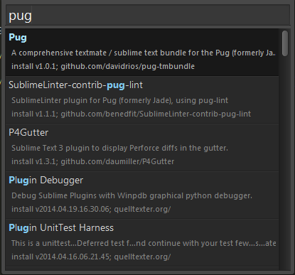
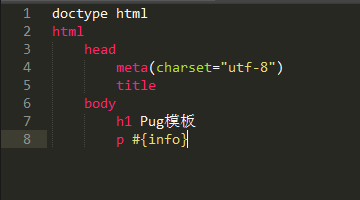
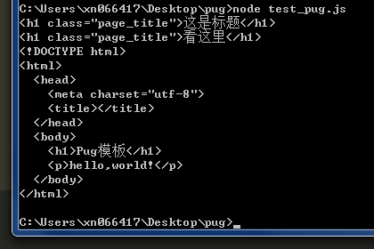

# Pug模板


Pug原名Jade，由于Jade是个注册商标，所以改名了。

官网：[https://pugjs.org](https://pugjs.org)

GitHub:[https://github.com/pugjs/pug](https://github.com/pugjs/pug)

## 导读
1. 安装&运行
2. 语法
3. 特点缺点
4. 比较
5. 其他

## 安装&运行

### 安装

npm安装

```bash
npm install pug
npm install pug-cli -g
```

Sublime 插件：在包管理(Ctrl + Alt + P)中搜索[Pug](https://github.com/davidrios/pug-tmbundle)



### 运行

+ 命令行

```bash
pug -P test.pug
```

test.pug 文件

```jade
doctype html
html
	head
		meta(charset="utf-8")
		title
	body
		h1 标题
```

编译结果

```html
<!DOCTYPE html>
<html>
  <head>
    <meta charset="utf-8">
    <title></title>
  </head>
  <body>
    <h1>标题</h1>
  </body>
</html>
```

+ 脚本

[API文档](https://pugjs.org/api/reference.html)

```javascript
const pug = require("pug");

// 渲染字符串
console.log(pug.render("h1.page_title 这是标题"));

// 渲染数据
console.log(pug.render("h1.page_title #{title}",{title:"看这里"}));

// 渲染文件
console.log(pug.renderFile("index.pug",{pretty:true,info:"hello,world!"}));

```




## 语法

和Python类似，Pug是通过缩进来表示层级。

+ 不能越级缩进，以下情况会报错。

```jade
ul
		li
	a
```

这样子就不会报错，但是无法正确格式化。

```jade
ul
	a
		li
	a
```

```html
<ul><a>
    <li></li></a><a></a></ul>
```

这样子就没问题了

```jade
ul
	li
		a
	li
```

```html
<ul>
  <li><a></a></li>
  <li></li>
</ul>
```

+ 能用空格或Tab缩进，但不能两种混合着用

### 标签

+ 在标签后面带个冒号，可以直接嵌套下一层标签。（注意，冒号后面有空格）

```jade
div: p: a: span test
```

```html
<div>
  <p><a><span>test</span></a></p>
</div>
```

+ 自动检测自闭合标签，且不允许自闭合标签带文本。以下情况会报错

```jade
img pic
```

强制自闭合标签

```jade
foo/
```

```html
<foo/>
```
[doctype对照表](https://pugjs.org/language/doctype.html)
<table>
	<tr>
		<td>doctype html</td><td>&lt;!DOCTYPE html&gt;</td>
	</tr>
	<tr>
		<td>doctype transitional</td><td>&lt;!DOCTYPE html PUBLIC "-//W3C//DTD XHTML 1.0 Transitional//EN" "http://www.w3.org/TR/xhtml1/DTD/xhtml1-transitional.dtd"&gt;</td>
	</tr>
	<tr>
		<td>doctype strict</td><td>&lt;!DOCTYPE html PUBLIC "-//W3C//DTD XHTML 1.0 Strict//EN" "http://www.w3.org/TR/xhtml1/DTD/xhtml1-strict.dtd"&gt;</td>
	</tr>
	<tr>
		<td>doctype basic</td><td>&lt;!DOCTYPE html PUBLIC "-//W3C//DTD XHTML Basic 1.1//EN" "http://www.w3.org/TR/xhtml-basic/xhtml-basic11.dtd"&gt;</td>
	</tr>
</table>

### 文本

标签名用空格隔开的内容当作标签文本。

```jade
p 测试文本

p 测试<b>文</b>本

p 
	| 测试
	b 文
	| 本

script.
	if(value){
		console.log("value is " + value);
	}else{
		console.log("there is not value");
	}
```

```html
<p>测试文本</p>

<p>测试<b>文</b>本</p>

<p>
   测试<b>文</b>本</p>

<script>
  if(value){
  	console.log("value is " + value);
  }else{
  	console.log("there is not value");
  }
</script>
```

### 属性

紧随标签后，用括号括起来，以空格分隔，自动补全值

```jade
input(class="tb" type="text" placeholder="something" disabled)
```

```html
<input class="tb" type="text" placeholder="something" disabled="disabled"/>
```

+ 支持js表达式

```jade
-var isShow = true
div(class=isShow ? "on" : "off")
```

```html
<div class="on"></div>
```

+ 支持多行

```jade
input(
	class="tb" 
	type="text" 
	placeholder="something" 
	disabled
)
```

```html
<input class="tb" type="text" placeholder="something" disabled="disabled"/>
```

+ 支持布尔值

```jade
input(type="radio" checked=true)
input(type="radio" checked=false)
```

```html
<input type="radio" checked="checked"/>
<input type="radio"/>
```

+ 支持对象转样式列表（仅支持style属性）

```jade
-var obj = {width:"120px",height:"120px",border:"solid 1px #f00"}
div(style=obj)
```

```html
<div style="width:120px;height:120px;border:solid 1px #f00;"></div>
```

+ 支持ID和类简写

```jade
div.foo
div#foo
.foo
```

```html
<div class="foo"></div>
<div id="foo"></div>
<div class="foo"></div>
```

+ 属性转义

```jade
-var val = "<script></script>";
div(data-v=val)
div(data-v!=val)
```

```html
<div data-v="&lt;script&gt;&lt;/script&gt;"></div>
<div data-v="<script></script>"></div>
```

### 代码

可以在模板中加入JS代码，用 - 作为行首表示JS代码。

```jade
ul
	-var ar = ["Tony","Jim","Peter","Lisa","Tiger"];
	-for(var i = 0,len = ar.length; i < len; i++){
		-if(i == 2){
			li=ar[i]+"!"
		-}else{
			li=ar[i]
		-}
	-}
```

```html

```

+ 变量插值

```jade
-var foo = 'Tom <>";&';

div=foo

div!=foo

div #{foo}

div #{foo.toUpperCase()}

div !{foo}

div \#{foo}

div=`${foo}`

div='Tom <>";&'
```

```html
<div>Tom &lt;&gt;&quot;;&amp;</div>
<div>Tom <>";&</div>
<div>Tom &lt;&gt;&quot;;&amp;</div>
<div>TOM &lt;&gt;&quot;;&amp;</div>
<div>Tom <>";&</div>
<div>#{foo}</div>
<div>Tom &lt;&gt;&quot;;&amp;</div>
<div>Tom &lt;&gt;&quot;;&amp;</div>
```

### 注释

+ 单行注释

```jade
// just a paragraph
p foo
//- will not output
```

```html
<!-- just a paragraph-->
<p>foo</p>
```

+ 块注释

```jade
body
//-
	will not output
	will not output
	will not output
//
	Comments for your HTML readers
	Comments for your HTML readers
```

```html
<!--
Comments for your HTML readers
Comments for your HTML readers
-->
```

### 循环及流程控制

+ each/if指令

```jade
ul
	each item in ["Tony","Jim","Peter","Lisa","Tiger"]
		li= item				
```

```html
<ul>
  <li>Tony</li>
  <li>Jim</li>
  <li>Peter</li>
  <li>Lisa</li>
  <li>Tiger</li>
</ul>
```

each后面带两个参数，第一个是value，第二个是key

```jade
ul
	each item,index in ["Tony","Jim","Peter","Lisa","Tiger"]
		if index == 0
			li #{item} is first
		else 
			li #{item}
```

```html
<ul>
  <li>Tony is first</li>
  <li>Jim</li>
  <li>Peter</li>
  <li>Lisa</li>
  <li>Tiger</li>
</ul>
```

+ each和else组合

```jade
ul
	each item in []
		li #{item}
	else
		li array is empty
```

```html
<ul>
  <li>array is empty</li>
</ul>
```

+ while

```jade
- var n = 0;
ul
  while n < 4
    li= n++
```

```html
<ul>
  <li>0</li>
  <li>1</li>
  <li>2</li>
  <li>3</li>
</ul>
```

+ case

相当于JS中的switch

```jade
- var friends = 10
case friends
  when 0
    p you have no friends
  when 1
    p you have a friend
  default
    p you have #{friends} friends
```

```html
<p>you have 10 friends</p>
```

多对一

```jade
- var friends = 0
case friends
  when 0
  when 1
    p you have very few friends
  default
    p you have #{friends} friends
```

```html
<p>you have very few friends</p>
```

使用break

```jade
- var friends = 0
case friends
  when 0
    - break
  when 1
    p you have very few friends
  default
    p you have #{friends} friends
```

```html

```


### 混入（Mixin）

### 包含（Include）

包含 .pug 文件时将对该文件进行编译，包含其他文件将作为纯文本进行引用

### 模板继承（Template Inheritance）